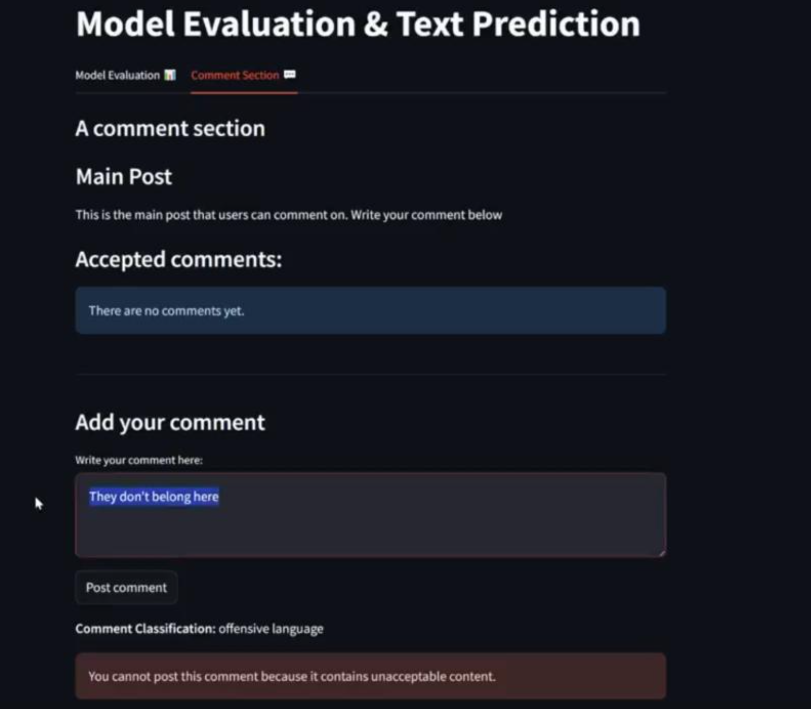
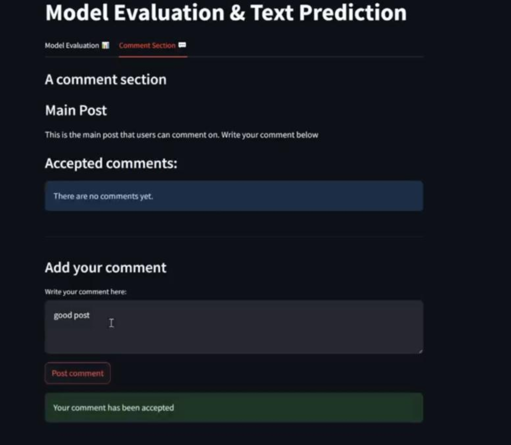
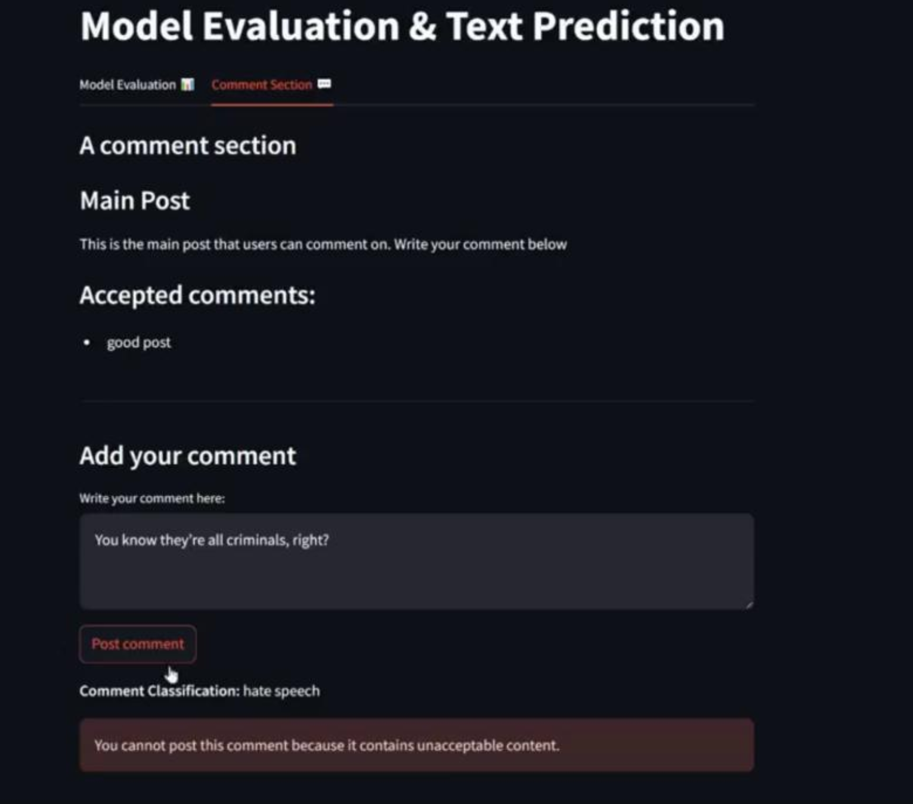
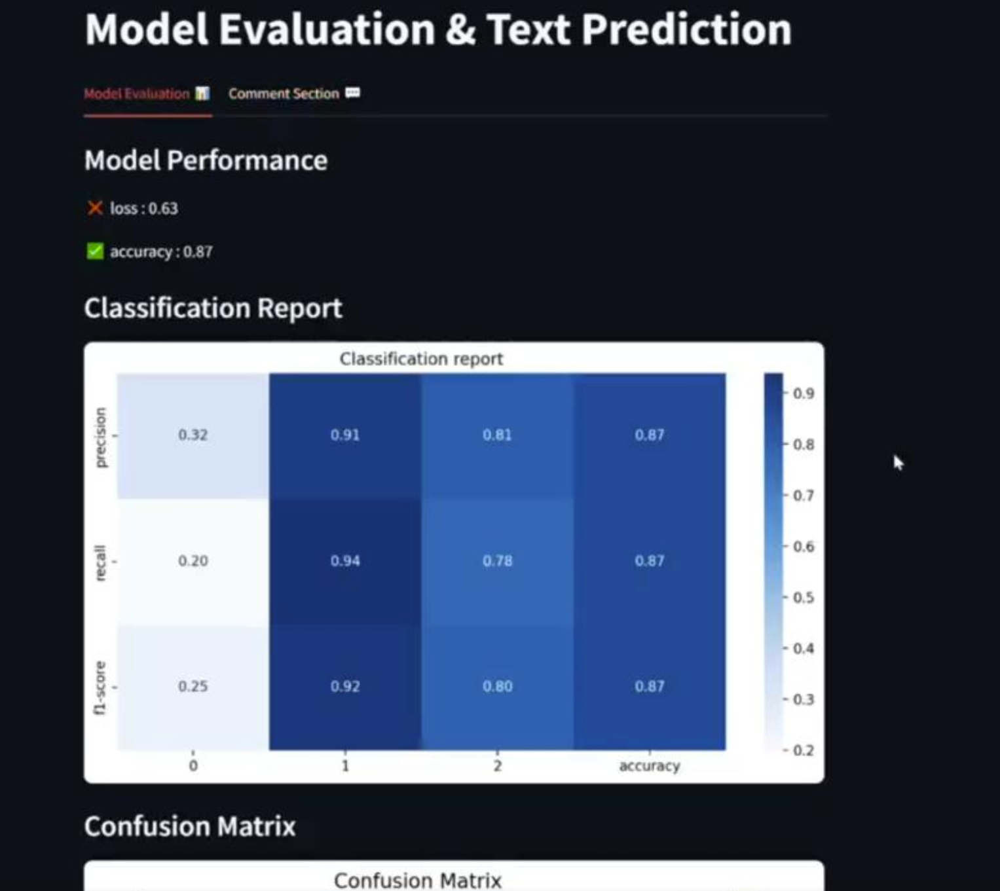
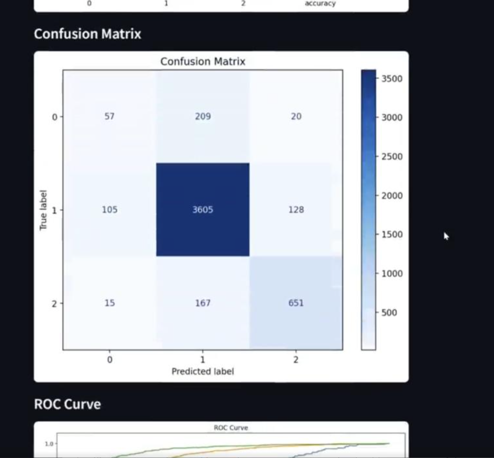
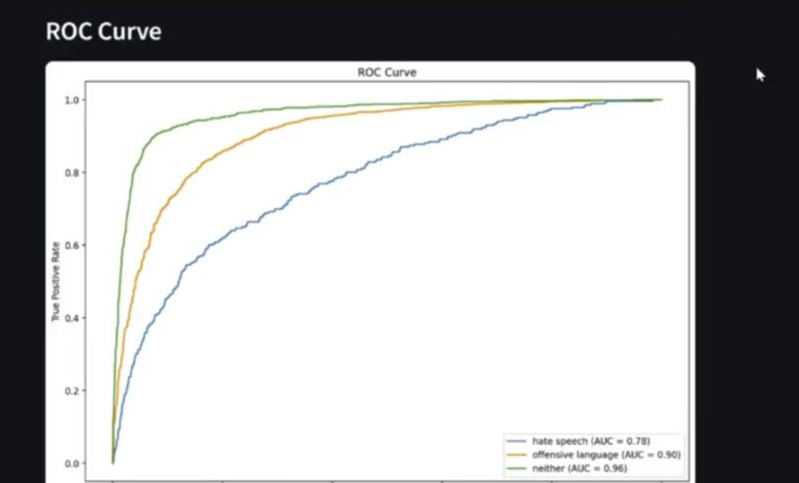

# 🧠 Hate Speech Detection Using LSTM NLP

A Streamlit-based application for classifying text into **hate speech**, **offensive language**, or **neither**, using a trained LSTM-based neural network. The app also includes a live comment moderation system.

---

## 📖 Introduction

This project demonstrates a complete NLP pipeline for detecting harmful or offensive content in text. Built using Streamlit, it allows users to explore model performance metrics and test live comments in real time.

---

## 🧾 Table of Contents

- [Introduction](#-introduction)
- [Features](#features)
- [Installation](#installation)
- [Usage](#usage)
- [Model Details](#model-details)
- [Data](#-data)
- [Configuration](#configuration)
- [Examples](#examples)
- [Troubleshooting](#troubleshooting)
- [Dependencies](#dependencies)
- [Output Snapshots](#-output-snapshots)
- [Contributors](#-contributors)
- [License](#-license)

---

## 📁 Project Structure

The repository contains the following files and folders:

```
.
├── main.py # Runs the Streamlit web app for model evaluation and comment filtering.
├── rnn.py # Trains the LSTM model and saves it along with the tokenizer.
├── utils.py # Contains helper functions for preprocessing, loading, and visualizing results.
├── hate_speech_data.csv # The dataset of tweets labeled as hate, offensive, or neither.
├── text_rnn.keras # The saved trained LSTM model used for prediction.
├── tokenizer.pkl # The saved tokenizer that converts text to sequences for the model.
├── requirements.txt # List of Python packages needed to run the project.
├── output/ #Folder holding screenshots of the app's UI and results.
│   ├── photo1.png
│   └── photo2.png
│   ├── photo3.png
│   └── photo4.png
│   ├── photo5.png
│   └── photo6.png
└── README.md Project documentation with instructions and explanations.
```

---

## Features

- Text preprocessing and cleaning
- LSTM-based hate speech classification
- Model evaluation with visual metrics
- Real-time comment moderation
- Interactive Streamlit interface

---

## Installation

1. **Clone the repository**:
   ```bash
   git clone https://github.com/omarsayah0/Hate-Speech-Detection-Using-Lstm-NLp.git
   cd Hate-Speech-Detection-Using-Lstm-NLp
   ```

2. **Install required packages**:
   ```bash
   pip install -r requirements.txt
   ```

3. **Download NLTK stopwords (if not already downloaded)**:
   ```python
   import nltk
   nltk.download('stopwords')
   ```

---

## Usage

### 🔹 Train the Model

This will generate `text_rnn.keras` and `tokenizer.pkl`.

```bash
python rnn.py
```

### 🔹 Launch the App

```bash
python -m streamlit run main.py
```

---

## Model Details

### 🧠 Model Architecture (Simple Explanation)

| Layer | Description |
|------|------------|
| Embedding (100 dimensions) | Converts words into dense vector representations that capture semantic meaning. |
| Bidirectional LSTM (128 units, return sequences) | Learns contextual relationships from both past and future words in the sentence. |
| Dropout (0.5) | Reduces overfitting by randomly disabling neurons during training. |
| Bidirectional LSTM (128 units) | Extracts higher-level sequential patterns from text. |
| Dropout (0.5) | Further prevents overfitting as the network gets deeper. |
| Dense (64, ReLU) | Learns abstract combinations of extracted textual features. |
| Dropout (0.5) | Improves generalization before final prediction. |
| Dense (3, Softmax) | Outputs probabilities for the three classes: hate speech, offensive language, and neither. |

---

## 📊 Data

- **File**: `hate_speech_data.csv`
- **Columns**:
  - `tweet`: Raw text input
  - `class`: Label (0 = hate speech, 1 = offensive language, 2 = neither)

---

## Configuration

- Vocabulary size: `10000`
- Maximum sequence length: `100`
- Epochs: `10`
- Batch size: `64`
- Optimizer: Adam

---

## Examples

- Model Evaluation tab shows accuracy, confusion matrix, ROC curve
- Comment Section allows or rejects comments based on prediction

---

## Troubleshooting

- Download NLTK stopwords if missing
- Ensure model and tokenizer files exist before running Streamlit

---

## Dependencies

From `requirements.txt`:

- `pandas`  
- `scikit-learn`  
- `tensorflow`  
- `nltk`  
- `streamlit`  
- `seaborn`  
- `matplotlib`  
- `numpy`  
- `pickle-mixin`

---

## 📸 Output Snapshots

  

❌ Comment Rejected: Offensive Language Detected
This image shows how the system flags and blocks harmful comments in real time. The model identified the input as offensive language and prevented it from being posted helping maintain a respectful and safe online space.

---

  

✅ Comment Accepted: Safe and Respectful Content
This image highlights how the system welcomes positive and neutral comments. The input was classified as appropriate and instantly approved encouraging healthy and respectful conversations.

---

  

❌ Comment Rejected: Hate Speech Detected
This image shows the system in action identifying and blocking harmful content. The input was accurately classified as hate speech and rejected to protect community space from toxic interactions.

---

  

Model Evaluation
This image highlights the performance of the hate speech detection model.
✔️ Accuracy: 87% — The model performs well in identifying different types of text.
Classification Report : Shows how well the model distinguishes between hate speech, offensive language, and neutral comments.

---

  

Confusion Matrix
This confusion matrix gives a clear picture of how well the model is classifying text into:

Hate Speech (0)
Offensive Language (1)
Neutral (2)

---

  

ROC Curve
This ROC Curve shows how confidently the model distinguishes between:

Hate Speech (AUC = 0.78)
Offensive Language (AUC = 0.90)
Neutral (AUC = 0.96)

---

## 👥 Contributors

- **Omar Alethamat** – *AI Engineer*

Feel free to open issues or pull requests to contribute.

---

## 📄 License

This project is licensed under the MIT License. See the [LICENSE](LICENSE) file for more details.
